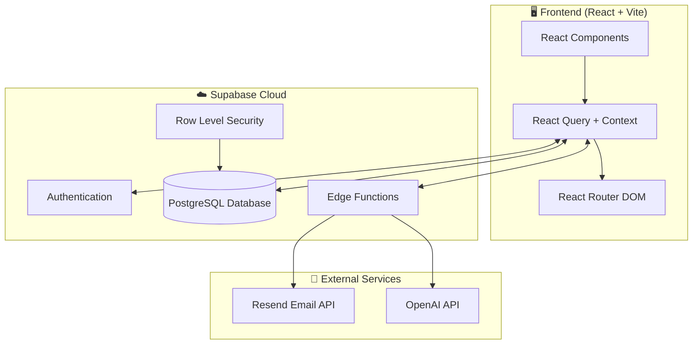
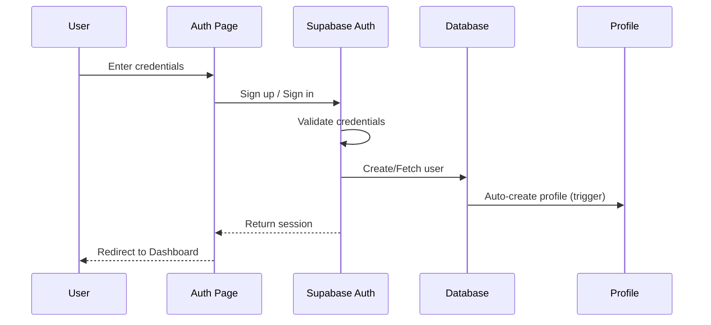
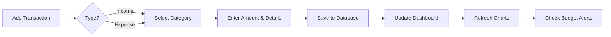
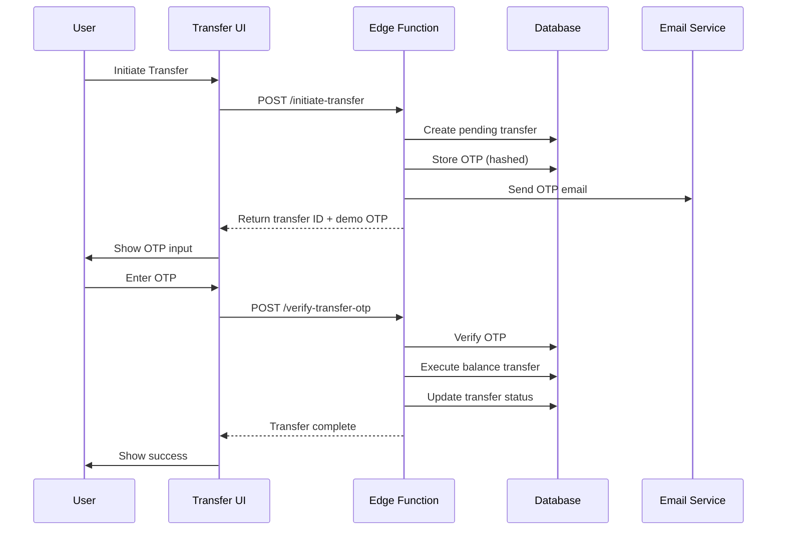
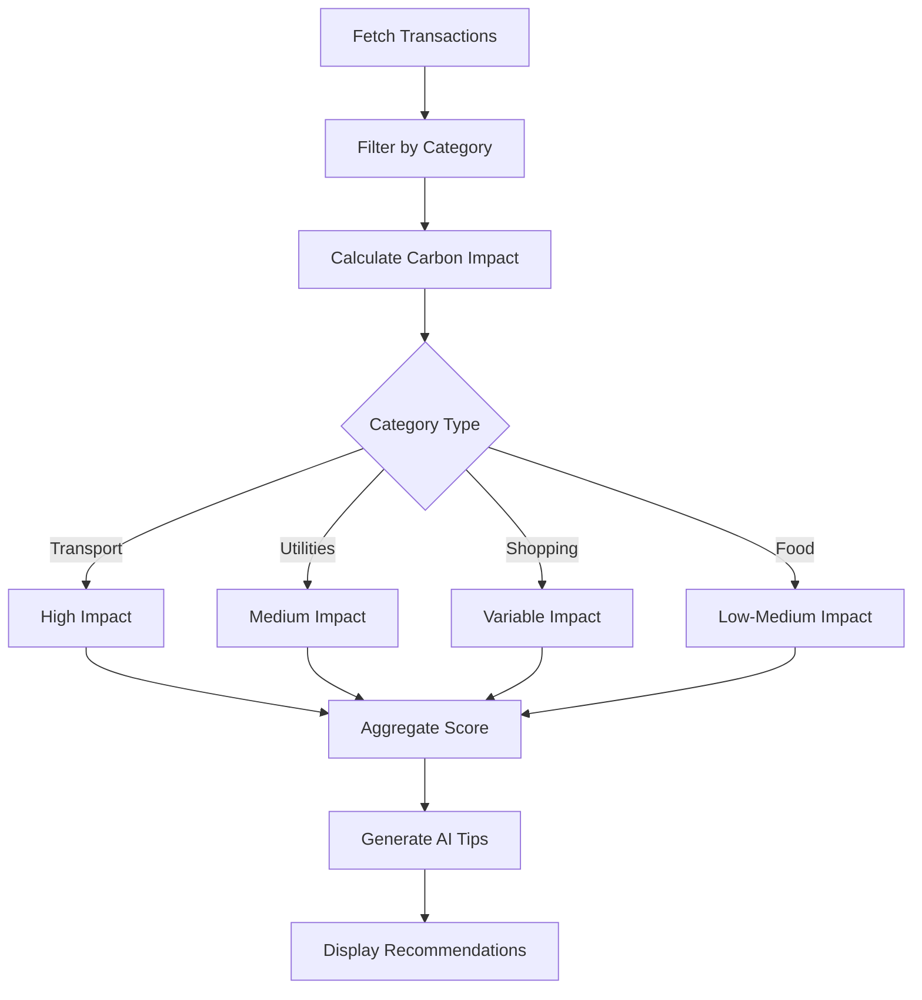

# 💰 Personal Finance Manager

A comprehensive **Personal Finance Manager** application that helps users track income, expenses, manage budgets, transfer funds between accounts, and monitor their environmental impact through carbon footprint tracking.

---

## 🎯 Problem Statement

Managing personal finances is challenging for many individuals due to:

- **Scattered financial data** across multiple platforms
- **Lack of visual insights** into spending patterns
- **No environmental awareness** of financial decisions
- **Insecure fund transfers** without proper verification
- **Complex budgeting** without intuitive tools

This application provides a **unified, secure, and eco-conscious** solution for personal finance management.

---

## 🏗️ System Architecture



---

## 🔄 Application Workflows

### User Authentication Flow



### Transaction Management Flow



### Fund Transfer Flow (with OTP)



### Carbon Footprint Analysis Flow



---

## 🛠️ Technology Stack

| Layer                | Technology       | Purpose                      |
| -------------------- | ---------------- | ---------------------------- |
| **Frontend**         | React 18         | UI Components & State        |
| **Build Tool**       | Vite             | Fast development & bundling  |
| **Styling**          | Tailwind CSS     | Utility-first styling        |
| **UI Components**    | shadcn/ui        | Accessible component library |
| **Routing**          | React Router DOM | Client-side navigation       |
| **State Management** | TanStack Query   | Server state & caching       |
| **Charts**           | Recharts         | Data visualization           |
| **Animations**       | Framer Motion    | Smooth transitions           |
| **Backend**          | Supabase         | BaaS (Auth, DB, Functions)   |
| **Database**         | PostgreSQL       | Relational data storage      |
| **Edge Functions**   | Deno             | Serverless API endpoints     |
| **Email**            | Resend           | Transactional emails         |
| **AI**               | OpenAI           | Financial insights & tips    |

---

## ✨ Features

### 📊 Dashboard

- Real-time financial overview
- Income vs Expense charts
- Category-wise spending breakdown
- Budget progress tracking
- Recent transactions list

### 💳 Transaction Management

- Add income/expense entries
- Categorize transactions
- Search & filter capabilities
- Date range filtering
- Export to PDF/CSV

### 🏦 Account Management

- Multiple bank accounts
- Secure fund transfers
- OTP verification
- Transfer history
- Balance tracking

### 🌱 Carbon Footprint Tracker

- Category-based carbon calculation
- Environmental impact score
- AI-powered eco-tips
- Sustainable spending insights

### 👤 User Profile

- Profile customization
- Budget configuration
- Mobile verification
- Avatar upload

### 🔐 Security

- Email/Password authentication
- Row Level Security (RLS)
- OTP-verified transfers
- Secure session management

---

## 📁 Project Structure

```
src/
├── components/
│   ├── ui/              # shadcn/ui components
│   ├── charts/          # Chart components
│   ├── Dashboard.tsx    # Main dashboard
│   ├── Navbar.tsx       # Navigation
│   └── ...
├── hooks/
│   ├── useAuth.ts       # Authentication
│   ├── useTransactions.ts
│   ├── useAccounts.ts
│   └── use-toast.ts
├── pages/
│   ├── Index.tsx        # Landing page
│   ├── Auth.tsx         # Login/Signup
│   ├── Transactions.tsx
│   ├── Accounts.tsx
│   └── ...
├── integrations/
│   └── supabase/        # Supabase client & types
└── utils/
    ├── pdfExport.ts
    └── fuzzySearch.ts

supabase/
├── functions/
│   ├── initiate-transfer/
│   ├── verify-transfer-otp/
│   ├── financial-chat/
│   └── generate-carbon-tips/
└── migrations/          # Database schema
```

---

## 🗄️ Database Schema

```mermaid
erDiagram
    PROFILES ||--o{ TRANSACTIONS : has
    PROFILES ||--o{ ACCOUNTS : owns
    ACCOUNTS ||--o{ TRANSFERS : from
    ACCOUNTS ||--o{ TRANSFERS : to

    PROFILES {
        uuid id PK
        string email
        string full_name
        string avatar_url
        number budget
        string mobile_number
        boolean mobile_verified
    }

    TRANSACTIONS {
        uuid id PK
        uuid user_id FK
        string title
        number amount
        string type
        string category
        date date
        boolean is_hidden
    }

    ACCOUNTS {
        uuid id PK
        uuid user_id FK
        string account_name
        string account_number
        number balance
    }

    TRANSFERS {
        uuid id PK
        uuid user_id FK
        uuid from_account_id FK
        uuid to_account_id FK
        number amount
        string status
        boolean otp_verified
        string otp_code
    }
```

---

## 🚀 Quick Start

### Prerequisites

- Node.js 18+
- npm or bun

### Installation

```bash
# Clone repository
git clone https://github.com/your-username/personal-finance-manager.git
cd personal-finance-manager

# Install dependencies
npm install

# Start development server
npm run dev
```

### Environment Variables

```env
VITE_SUPABASE_URL=your_supabase_url
VITE_SUPABASE_ANON_KEY=your_supabase_anon_key
```

---

## 📜 Available Scripts

| Command           | Description              |
| ----------------- | ------------------------ |
| `npm run dev`     | Start development server |
| `npm run build`   | Build for production     |
| `npm run preview` | Preview production build |
| `npm run lint`    | Run ESLint               |

---

## 🔒 Security Features

- **Row Level Security (RLS)**: Users can only access their own data
- **OTP Verification**: Secure fund transfers with email verification
- **Password Hashing**: Secure credential storage via Supabase Auth
- **HTTPS**: All communications encrypted in transit

---

## 📧 Contact

**Sai Kowshik Suggala**  
📧 saikowshiksuggala9390@gmail.com  
🔗 [GitHub: KowshikSuggala25](https://github.com/KowshikSuggala25)

---

## 📄 License

This project is open source and available under the [MIT License](LICENSE).
